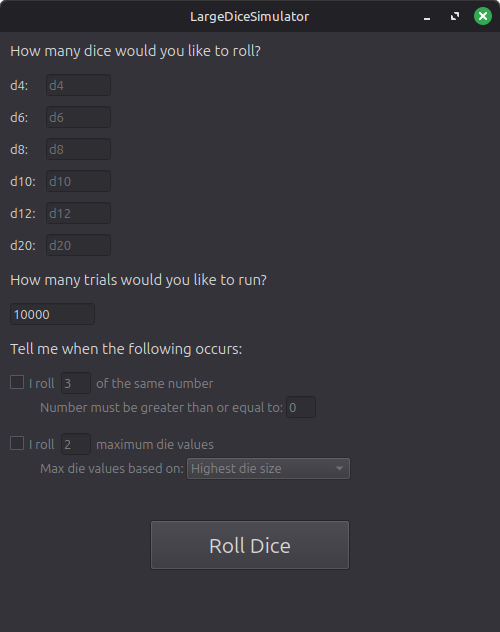
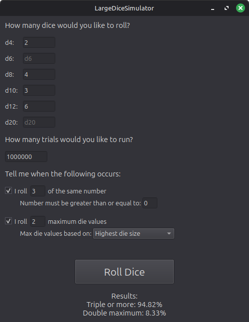

# LargeDieSimulator
For rolling very large amounts of very specific dice with customizable conditions

## About
LargeDieSimulator is a C++/Qt 6 application intended for situations where manually calculating probabilities becomes impractical. The goal is to provide a flexible tool for exploring complex dice scenarios through large-scale simulation.

## Current Status
**Work in progress**

The application has full functionality of the originally intended version of the project available through the GUI. That is to say, the current output always displays data pertaining to rolling 3x of the same number, and 2x of the maximum possible number. The ability to tweak which results are displayed is in progress, and the following list of features are planned additions:

- Ability to add custom conditions through a dropdown menu or "click to add" style prompt, rather than a static checkbox menu. This will allow for much more customizability, and also allow for multiple of the same type of condition to be tracked at once (For example, if you want to display the percentage for rolling 3x of the same number, and 4x of the same number, within the same set of trials).
- Ability to export/import or otherwise save conditions, for those that have a consistent set of parameters or base that they like to work off of.
- An "approximate time to run" label that appears once a valid number of dice and trials have been added. This application can run hundreds of thousands of trials of reasonable amounts of dice within seconds, but once you get into the millions for dice amounts and trials, things can slow down massively. This will help to discourage running trials that are waaaay too large without properly planning for it first.
- Add a "Rolling..." dot progression animation while results are pending. Just to give the user something to look at and be confident that the application hasn't crashed or frozen while running long trials. This also enforces better backend logic handling by forcing the dice rolls to take place within their own thread so the GUI can still update in the meantime.
- (Maybe) Add a way to export results into some sort of basic spreadsheet file that holds the parameters used and tracked outcomes. For saving and easy sharing of data. This may be over the top and not really needed when most reasonable simulations can run in about 1 second, but the whole point of this application is to account for insane scenarios, so a way to save results outside of a screenshot would be nice.

